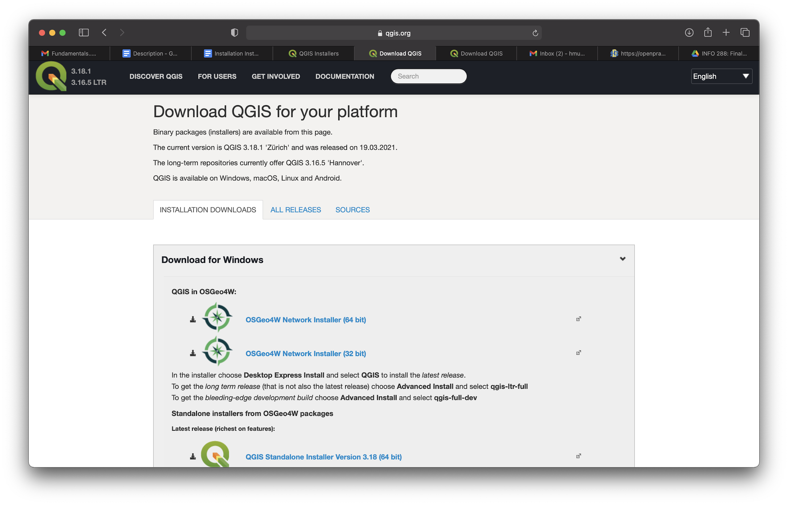
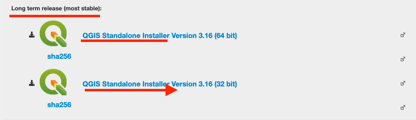
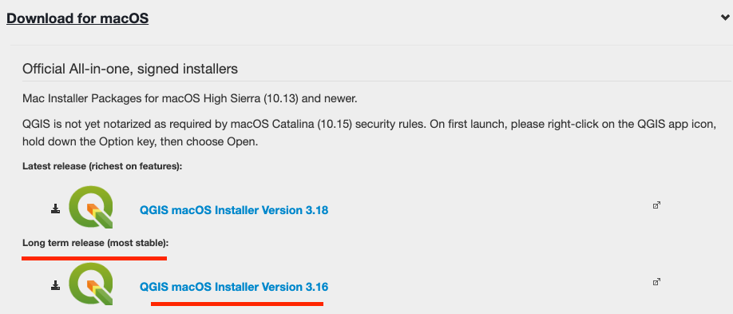

In preparation for the upcoming workshop you will need to install QGIS
and the workshop materials.

**1. Install QGIS**

QGIS is free and open source and installation is detailed on the main
website:
[[https://qgis.org/en/site/forusers/download.html]{.ul}](https://qgis.org/en/site/forusers/download.html)

{width="6.5in" height="3.706573709536308in"}

[The following installations are general guidelines and may change in
the future depending on the developers.]{.ul}

[Windows:]{.ul}

1.  You have the option to either install the standalone version of QGIS
    > or install it in OSGeo4W

    a.  For new users, the **standalone version** is recommended

2.  If you're using the standalone version:

    a.  Go to the [[download
        > page]{.ul}](https://qgis.org/en/site/forusers/download.html)
        > and either download the 32bit or 64bit version of QGIS

    b.  Select the Long Term Stable Release!

> {width="5.041666666666667in"
> height="1.4895833333333333in"}

3.  If you're using the OSGeo4W version:

    a.  Go to the [[download
        > page]{.ul}](https://qgis.org/en/site/forusers/download.html)
        > and either download the 32bit or 64bit version of OSGeor4W
        > installer

    b.  Select *Desktop Express Install* and install the latest version
        > of QGIS

        i.  If you want the long term release, select *Advanced Install*
            > and select *qgis-ltr-full* or *qgis-ltr*

        ii. There's also an option to install the development version

[Mac:]{.ul}

1.  Go to the [[download
    > page]{.ul}](https://qgis.org/en/site/forusers/download.html) and
    > download the latest version of QGIS

    a.  Note that this is for macOS Sierra or later (10.13)

    b.  If you are using 10.15 or later QGIS may not be notarized yet.
        > The first time you open the application you'll need to right
        > click on the icon, hold the option key, and manually pick
        > *Open*.

> {width="5.432292213473316in"
> height="2.324394138232721in"}

**2. Download the workshop materials**

Download the workshop materials by visiting the GitHub repository:

[[https://github.com/dlab-berkeley/Geospatial-Fundamentals-in-QGIS]{.ul}](https://github.com/dlab-berkeley/Geospatial-Fundamentals-in-QGIS)

To download the repository, click the green button in the top right hand
corner that says \"Code\" and then select \"Download ZIP\". You can then
unzip the contents of the downloaded folder somewhere accessible on your
local computer (we recommend your Desktop).

If you are a Git user, simply clone this repository by opening a
terminal and typing: "git clone
https://github.com/dlab-berkeley/Geospatial-Fundamentals-in-QGIS.git\"

We will take a few minutes at the start of the workshop to make sure
everyone has QGIS installed and the workshop materials downloaded.
Please feel free to email
[[dlab-frontdesk\@berkeley.edu]{.ul}](mailto:dlab-frontdesk@berkeley.edu)
or visit our help desk at
[[https://dlab.berkeley.edu/frontdesk]{.ul}](https://dlab.berkeley.edu/frontdesk)
if you have any questions.

**3. Is QGIS not working on your laptop?**

Attend the workshop anyway, we can provide you with a cloud-based
solution (DataHub or Binder) until you figure out the problems with your
local installation.

If you have a Berkeley CalNet ID, you can run these lessons on UC
Berkeley\'s DataHub by clicking [[this
link]{.ul}](https://datahub.berkeley.edu/hub/user-redirect/git-pull?repo=https%3A%2F%2Fgithub.com%2Fdlab-berkeley%2FGeospatial-Fundamentals-in-QGIS&urlpath=tree%2FGeospatial-Fundamentals-in-QGIS%2F&branch=master).
By using this link, you can save your work and come back to it at any
time. When you want to return to your saved work, just go straight to
DataHub
([[https://datahub.berkeley.edu]{.ul}](https://datahub.berkeley.edu)),
sign in, and you click on the GIS-fundamentals-with-QGIS folder.

If you don\'t have a Berkeley CalNet ID, you can still run these lessons
in the cloud, by clicking this [[Binder
button]{.ul}](https://notebooks.gesis.org/binder/jupyter/user/dlab-berkeley-g-mentals-in-qgis-k22srt2e/tree).
By using this button, you cannot save your work unfortunately.

[Other Resources:]{.ul}

-   User guide:
    > [[https://docs.qgis.org/3.16/en/docs/user_manual/]{.ul}](https://docs.qgis.org/3.16/en/docs/user_manual/)

-   Training manual:
    > [[http://docs.qgis.org/latest/en/docs/training_manual/]{.ul}](http://docs.qgis.org/latest/en/docs/training_manual/)

-   Other training materials:
    > [[https://qgis.org/en/site/forusers/trainingmaterial/index.html]{.ul}](https://qgis.org/en/site/forusers/trainingmaterial/index.html)

-   Community support:
    > [[https://qgis.org/en/site/forusers/support.html]{.ul}](https://qgis.org/en/site/forusers/support.html)

***NOTE: D-Lab workshops normally start 10 minutes after the scheduled
start time ("Berkeley Time"). We recommend you log on at the start time
to join the waiting room where hosts will message you further
information.***
